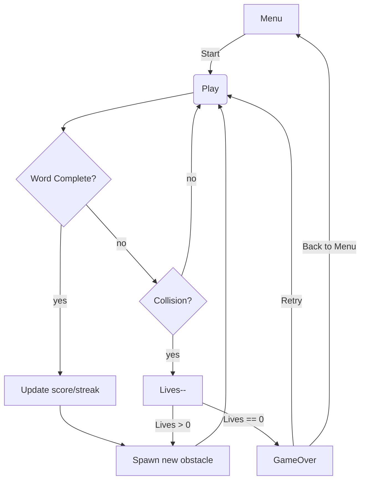

# Yatiksu – Complete Engineering Blueprint

_A desktop-first, offline 8-bit typing runner (Phaser 4 + TypeScript)_

---

## 0. Executive Summary

Yatiksu is a Flappy-Bird-style endless runner where progress is gated by correctly typing words before the avatar collides with obstacles.  
Scope v1 targets **desktop keyboards**, **100 % offline play**, and uses only CC-0 / MIT-compatible assets. All data (scores, settings) lives in `localStorage`; no server is required.

---

## 1. Tech Stack

| Layer                  | Selection                                                                          | Rationale                                          |
| ---------------------- | ---------------------------------------------------------------------------------- | -------------------------------------------------- |
| **Engine**             | **Phaser 4** (TypeScript)                                                          | Lightweight, pixel-perfect, familiar API           |
| **Bundler/Dev**        | **Vite + ESBuild**                                                                 | Instant HMR, zero-config TS                        |
| **State Mgmt**         | **Zustand**                                                                        | Minimal boilerplate                                |
| **Persistence**        | **localStorage** (JSON string)                                                     | Tiny footprint, sufficient for highscores/settings |
| **Offline**            | `vite-plugin-pwa` → Workbox service worker                                         | Installable PWA & cache-first assets               |
| **Lint/Format**        | ESLint × Prettier × Husky (pre-commit)                                             | Consistent codebase                                |
| **CI**                 | GitHub Actions (lint → build → Cypress smoke)                                      | Auto-verify PRs                                    |
| **Hosting (optional)** | Vercel / Netlify (static deploy)                                                   | CDN + HTTPS with zero backend                      |
| **Asset Tools**        | Aseprite (sprites) · Kenney CC-0 placeholder art · Bfxr (SFX) · BeepBox.cc (music) | Zero licensing headaches                           |

---

## 2. Directory Layout

```

yatiksu/
├─ public/
│   ├─ icons/              # PWA icons 192/512 px
│   └─ manifest.webmanifest
├─ src/
│   ├─ main.ts             # Boots Phaser & registers scenes
│   ├─ scenes/
│   │   ├─ Boot.ts
│   │   ├─ Menu.ts
│   │   ├─ Play.ts
│   │   └─ GameOver.ts
│   ├─ systems/            # Typing, scoring, persistence helpers
│   ├─ data/
│   │   └─ words/          # easy.json · medium.json · hard.json
│   └─ assets/             # spritesheets · sfx · music
├─ LICENSE                 # MIT (2025 © S. Khuntia)
├─ README.md               # Player & dev guide
└─ tsconfig.json

```

---

## 3. Core Gameplay Mechanics

| Feature          | Implementation Detail                                                                              |
| ---------------- | -------------------------------------------------------------------------------------------------- |
| **Lives**        | 3 starting hearts ➝ +1 life every 40-word flawless streak (cap 5).                                 |
| **Speed**        | `base = 120 px/s` ➝ `+8 px/s` after every 10 correctly typed words.                                |
| **Obstacle Gap** | Distance = `word.length × 45 px + 120 px` (≈2–4 s to finish any word, whatever speed tier).        |
| **Scoring**      | `10 × word.length × (1 + floor(streak/20)*0.25)`; streak resets on any miss.                       |
| **Power-ups**    | 5 % spawn rate: **ICE** (freeze scroll 1 s) or **BOMB** (clear next obstacle).                     |
| **Word Tiers**   | Three JSON lists (easy 3-5 chars, medium 5-7, hard 8-12). Tier picked by “level” (every 10 words). |

---

## 4. Word-Typing System (Play Scene)

1. Load current word string → display above obstacle.
2. Listen to `keydown`.
    - **Correct key** → reveal letter & advance caret.
    - **Incorrect** → flash red (no penalty unless timer expires).
3. On word complete → award score, increment streak, spawn next obstacle with updated speed.
4. On avatar-obstacle collision → `lives--`; if `lives === 0` show GameOver.

---

## 5. Game Flow Diagram (Mermaid)



---

## 6. UI / UX Specification

- **Canvas**: 960 × 540, CSS-scaled with `image-rendering: pixelated` for crisp edges.
- **HUD**:

    - Hearts (👾 sprites) top-left.
    - Score & combo top-right.

- **Settings modal** (ESC):

    - Toggle music/SFX.
    - Dyslexic-friendly bitmap font.
    - Clear highscores (reset localStorage).

---

## 7. Data Persistence API

```ts
interface SaveData {
  bestScore: number;
  lastScores: ScoreEntry[]; // last 10 runs
  settings: { muted: boolean; dyslexicFont: boolean };
}

const STORAGE_KEY = 'yatiksu-save-v1';

export function loadData(): SaveData { ... }
export function saveRun(score: number): void { ... }
export function updateSettings(patch: Partial<SaveData['settings']>): void { ... }
```

---

## 8. Build & Run Commands

```bash
pnpm i                       # install deps
pnpm dev                     # vite dev server @ localhost:5173
pnpm build                   # production build to /dist
pnpm preview                 # serve /dist locally
```

---

## 9. Six-Week Sprint Plan

| Week | Goal / Milestone                                                                           |
| ---- | ------------------------------------------------------------------------------------------ |
| 1    | Vite + Phaser scaffold, placeholder sprite renders in Boot Scene.                          |
| 2    | Typing engine (caret, highlights, word-complete callback).                                 |
| 3    | Scrolling ground, avatar running animation, obstacle collisions.                           |
| 4    | Score, combo, lives, GameOver screen, `localStorage` persistence.                          |
| 5    | Replace placeholders with custom 16×16 sprites, add Bfxr SFX + BeepBox loop.               |
| 6    | PWA (service worker & manifest), accessibility pass, performance polish, deploy to Vercel. |

---

## 10. Asset Production Checklist

| Asset            | Tool & Spec                                                 |
| ---------------- | ----------------------------------------------------------- |
| **Avatar**       | Aseprite · 16×16 · 4-frame run, idle, fail                  |
| **Ground tiles** | 16×16 repeating pattern (parallax optional)                 |
| **Obstacle**     | 16×16 “pipe” or “rock” sprite + 2-frame hit burst           |
| **Power-ups**    | ICE crystal · BOMB box (single frame)                       |
| **SFX**          | Bfxr presets (“coin”, “hit”, “power-up”) exported WAV → Ogg |
| **Music**        | 60-s NES-style loop @ 120 BPM via BeepBox                   |

_(All created or remixed under CC-0 or MIT)._

---

## 11. Stretch Goals (Post-v1)

- **Daily Challenge** – seeded word list rotates at UTC 00:00.
- **Ghost Replay** – store key timestamps and allow self-race.
- **Electron Wrapper** – cross-platform desktop app.
- **Multiplayer Race** – WebSocket lobby; first to N words wins (server can be Supabase Edge Functions).

---

## 12. MIT License Notice

```
© 2025 Siddhartha Khuntia
Released under the MIT License.
```

_(Full MIT text lives in `/LICENSE`; all original art & code inherits the same license)._

---

### End of Blueprint

Copy this document into your repo’s `docs/` folder (or paste directly into ChatGPT, GitHub Copilot, etc.) to give any LLM full project context while coding.

```

```
